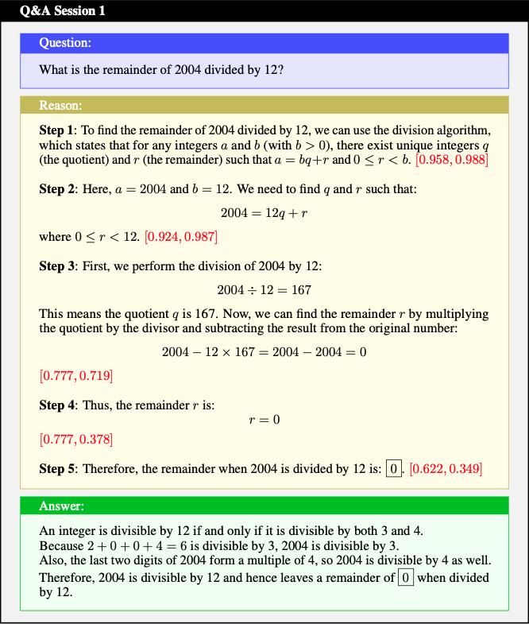
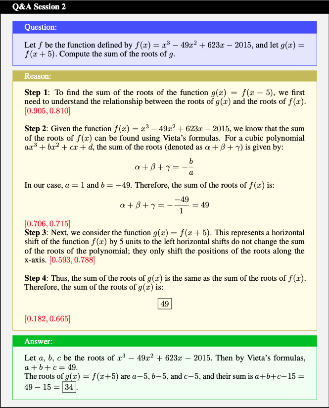
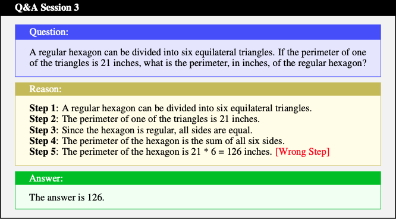
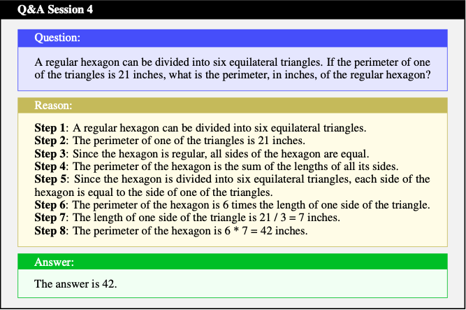
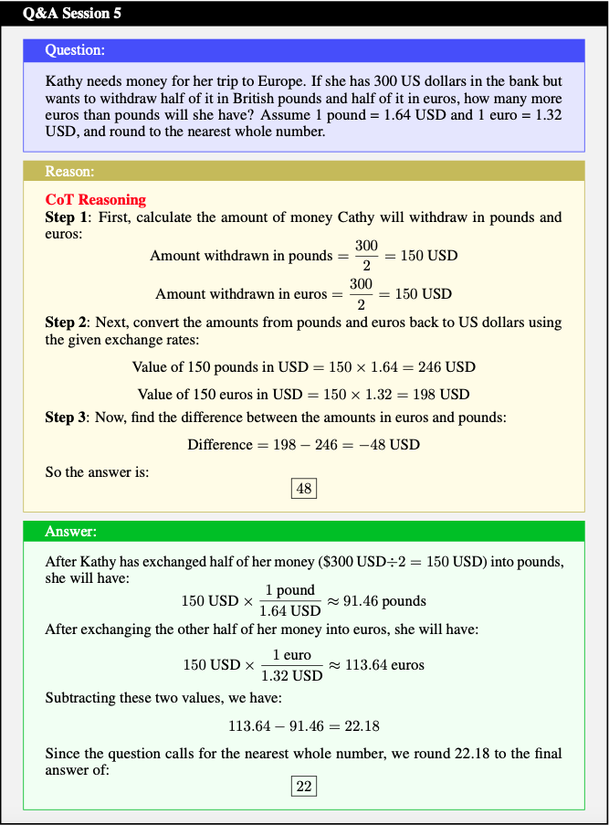
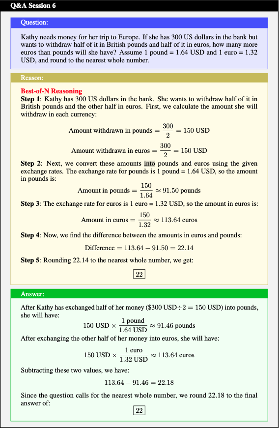
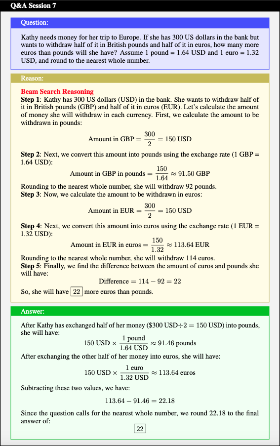

# Response Example
{: .no_toc}

## Table of contents
{: .no_toc .text-delta }

1. TOC
{:toc}

## Comparing PRM, Math-psa (Ours) V.S. Math-Shepherd

  
  

## Justifing RL Training

  
  

## Exploring Test-time Computation

  
  
    

