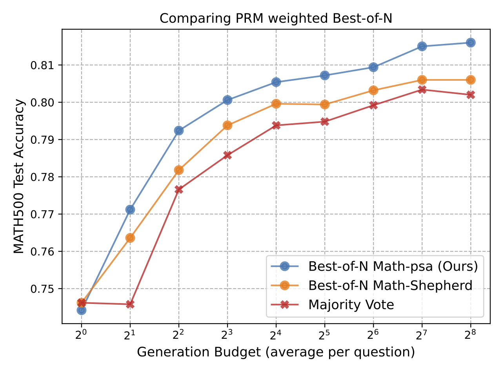
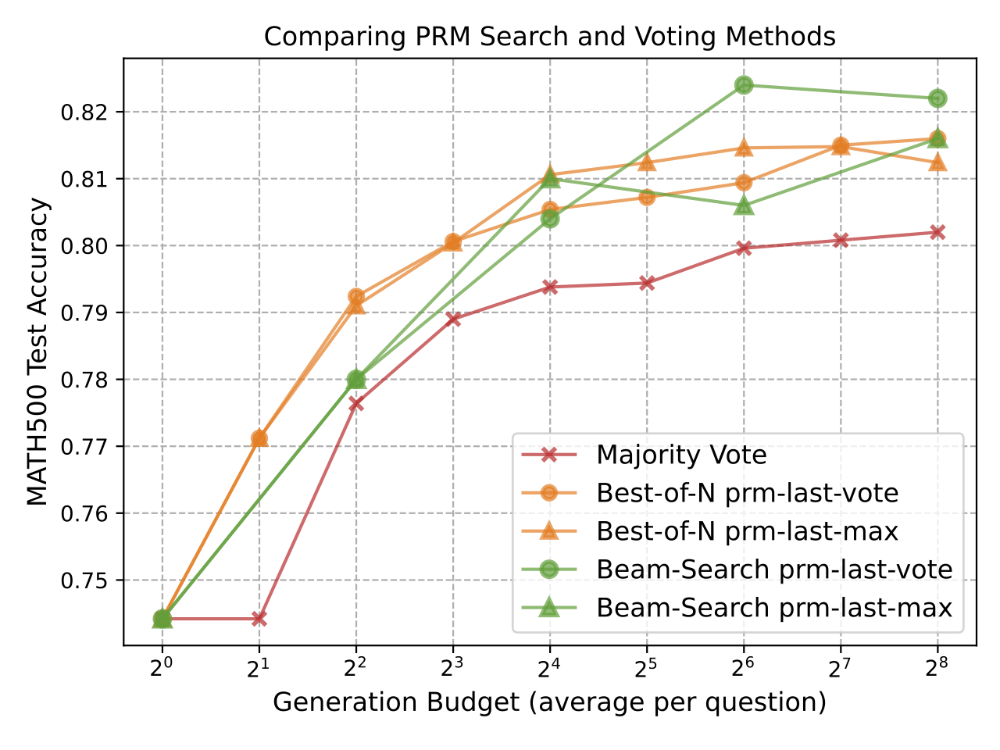
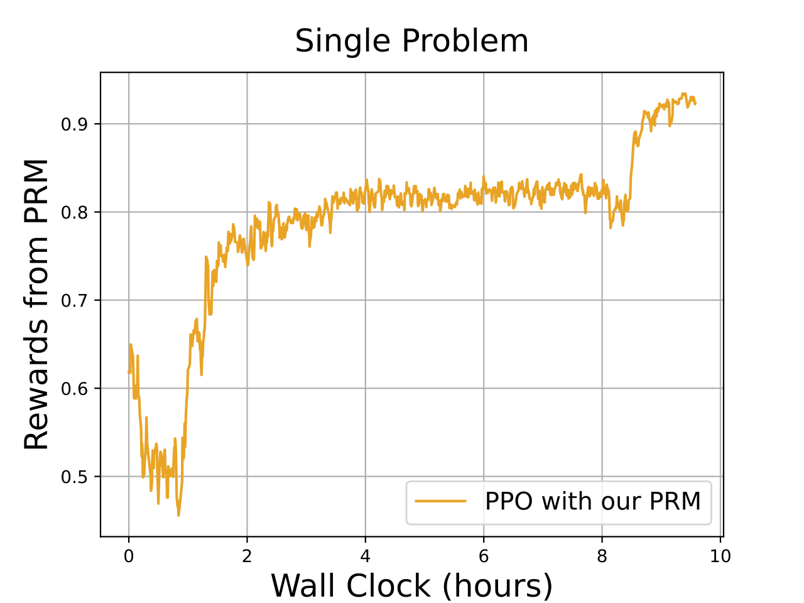
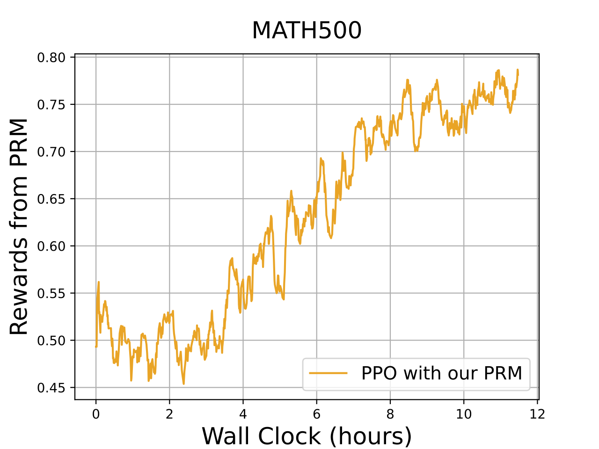

# Results
{: .no_toc}

<!-- ## Table of contents
{: .no_toc .text-delta }

1. TOC
{:toc} -->

## Comparing PRM Weighted Best-of-N

The figure shows that our PRM (Math-aps) can achieve the highest testing accuracy across all tested computation budgets. This indeed has verified that our PRM training pipeline can provide effective learning of process supervision.

## Comparing PRM Search and Voting Methods

Both Best-of-N and Beam-Search methods significantly outperform Majority Vote, especially as the generation budget increases, showing a similar pattern with previous findings. Under low test-time computation budgets ($< 2^4$), Best-of-N methods demonstrate better performance compared to Beam Search, whereas Beam Search can reach matching performance given higher budgets, or even surpass Best-of-N with *PRM-Last* strategy used at budgets larger than $2^5$.

## Online RL Leanring

  
  

Left plot illustrates the reward obtained by a reinforcement learning (RL) algorithm with process reward models (PRM) on a single math problem. The rewards steadily increase over time, showing consistent improvement, with performance stabilizing after around 6 hours of training. This indicates that the model becomes more accurate in solving the specific problem as training progresses.

On the MATH500 dataset, results exhibit more fluctuations in rewards. This suggests that the PPO algorithm with PRM faces a more complex challenge due to the diversity of problems in the dataset. Although the rewards increase over time, their variability highlights the difficulty of generalizing
across a broader set of problems. This indicates the need for further improvement of the algorithm to enhance its adaptability for diverse problem sets in future work.