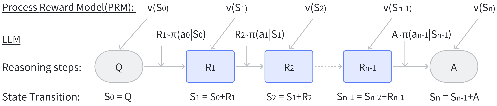

<script type="text/javascript" async
  src="https://cdn.jsdelivr.net/npm/mathjax@3/es5/tex-mml-chtml.js">
</script>


# Environments

We transform math problems into a language-augmented Markov Decision
Process (MDP). 

## Reasoning as Markov Decision Process (MDP)

We formulate a reasoning process $$ Q \rightarrow \{R\} \rightarrow A$$ as a MDP where each state $$S_t$$ is an aggregation of previous state $$S_{t-1}$$ and current reasoning output $$R_t$$. The current reasoning output is an "action" generated from a LLM policy $$\pi (R\mid S) $$. The reward function $$V(S)$$ can be a PRM.

<br>





## Class `CoTEnv` 

Take `class: CoTEnv(BaseEnv)` as an example, an initial state $$s_0$$ represents a given mathematical problem:

```python
self._init_query = self.build_query_str(
    cot_examples=self._cot_example_str,
    cot_task_desc=self._task_desc_str,
    problem_format_str=self._problem_format_str,
    problem_input=self.math_problem["question"],
    is_few_shot=self.is_few_shot,
)
```
A language model will receive  this input and generates an intermediate reasoning step, denoted as an action $$a_0$$:
```python
self.action_history.append(action)
```
This action $$a_0$$ is then concatenated with the initial problem $s_0$ to form the subsequent state $$s_1 = [s_0, a_0]$$:
```python
def get_state(self):
    ret = self._init_query + "".join(self.action_history)
    return ret
```
which is used to infer the next action $$a_1$$. This iterative process continues, until the model aarrives at the final answer. After inferring each action $$a_t$$, the model receives a reward signal $$r_t^{PRM} = R(s_t, a_t)$$ from a well-trained PRM:
```python
def get_reward(self):
    """To implement based on learned reward model"""
    raise NotImplementedError
```

We correspondingly implement this MDP as a reinforcement learning environment similar to OpenAI’s Gym:
```python
def step(self, action, update_legal_action=True):
        self.action_history.append(action)
        state = self.get_state()
        reward = self.get_reward()
        terminated, truncated, info = self.get_done_and_info()
```


## Class `MATH_ENV`

Mostly Based on `CoTEnv`, with additional modification of CoT example and problem formats. In `/envs/MATH/datasets` we provide both training and testing math problems as an example. You can also test the environment by running testing code `/envs/tests/test_math.py`


<!-- ## `RL_ENV` -->
